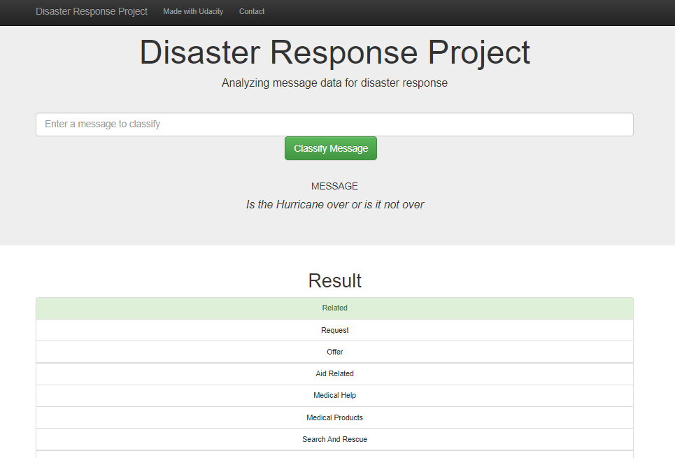
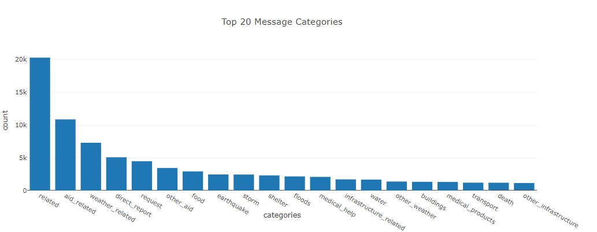

# Disaster Response Pipeline

Analyze disaster data from Figure Eight to build a model for an API that classifies disaster messages.
Building a ETL pipeline and  Machine Learning pipeline (build a supervised machine learning models) on text data from tweets and text messages from real life desasters and a webapp to classify this messages. 

### Table of Contents

1. [Installation](#installation)
2. [Project Motivation](#motivation)
3. [Scripts and Instructions](#scripts)
4. [File Descriptions](#files)
5. [Screenshots](#screenshots)
6. [Results](#results)
7. [Licensing, Authors, and Acknowledgements](#licensing)

## Installation 

You will need the standard data science libraries found in the Anaconda distribution of Python. The code should run with no issues using Python versions 3.*.

All libraries are available in Anaconda distribution of Python. The used libraries are:

- pandas
- numpy
- re
- sklearn
- nltk
- sqlalchemy
- pickle
- os
- sqlite3
- create_engine (sqlalchemy)

## Project Motivation

For this project, I will build a Machine Learning model that can help respond to future desasters.

## Scripts and Instructions 

1. Run the following commands in the project's root directory to set up your database and model.

    - To run ETL pipeline that cleans data and stores in database
        `python data/process_data.py data/disaster_messages.csv data/disaster_categories.csv data/DisasterResponse.db`
    - To run ML pipeline that trains classifier and saves
        `python models/train_classifier.py data/DisasterResponse.db models/classifier.pkl`

2. Run the following command in the app's directory to run your web app.
    `python run.py`

3. To see webapp runing go to http://0.0.0.0:3001/

## File Descriptions 

The following are the files available in this repository:

* `ETL Pipeline Preparation.ipynb` - a JUPYTER notebook containing ETL Pipeline.

* `ML Pipeline Preparation.ipynb`- a JUPYTER notebook containing ML Pipeline.

* `/data/process_data.py` - python file, scripts that does the cleaning process. Contains the ETL pipeline process. In the end it stores everything to a SQLite database file.

* `/data/disaster_categories.csv` - csv file, categories dataset.

* `/data/disaster_messages.csv` - csv file, messages dataset.

* `/data/DisasterResponse.db` - database file (SQLite), containing the results generated by the process_data.py file.

* `/models/train_classifier.py` - python file, scripts that builds a text processing and machine learning pipeline. In the end it stores everything to a pickle file.

* `/app/run.py` - flask file to run the app.

* `/app/templates/master.html` - main page of the webapp.

* `/app/templates/go.html` - results page of the webapp.

## Screenshots

## Results

You can check the results and visualizations on the webapp.
 

## Licensing, Authors, Acknowledgements

The data was provided by Figure Eight. And the challenge (project) was proposed by Udacity.

